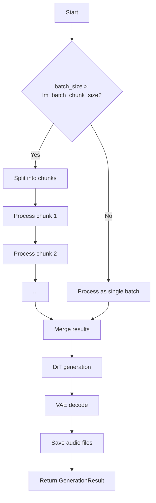

## Overview

`GenerationConfig` is a dataclass that controls batch processing, seed management, and output formatting for music generation.

```python
from acestep.inference import GenerationConfig

config = GenerationConfig(
    batch_size=4,
    use_random_seed=False,
    seeds=[42, 123, 456, 789],
    audio_format="flac"
)
```

## Parameters

<ParamField path="batch_size" type="int" default="2">
  Number of audio samples to generate in parallel (1-8).
  
  Higher values require more GPU memory. Consider reducing if encountering OOM errors.
  
  **Note:** The system includes automatic VRAM guard that may reduce batch size if needed.
</ParamField>

<ParamField path="allow_lm_batch" type="bool" default="False">
  Whether to allow batch processing in LM.
  
  Faster when `batch_size >= 2` and `thinking=True` in GenerationParams.
  
  **Recommended:** Enable for batch generation with LM enabled.
</ParamField>

<ParamField path="use_random_seed" type="bool" default="True">
  Whether to use random seed for generation.
  
  - `True`: Different results each time (stochastic)
  - `False`: Reproducible results (deterministic)
</ParamField>

<ParamField path="seeds" type="Optional[List[int]]" default="None">
  List of seeds for batch generation. Can be:
  
  - `None`: Use random seeds (when `use_random_seed=True`) or `params.seed` (when `use_random_seed=False`)
  - `List[int]`: Explicit seed list - will be padded with random seeds if fewer than `batch_size`
  - `int`: Single seed value (converted to list and padded)
  
  **Example:**
  ```python
  # Generate 4 samples with specific seeds
  config = GenerationConfig(
      batch_size=4,
      seeds=[42, 123, 456],  # 4th will be random
      use_random_seed=False
  )
  ```
</ParamField>

<ParamField path="lm_batch_chunk_size" type="int" default="8">
  Maximum batch size per LM inference chunk (GPU memory constraint).
  
  If `batch_size > lm_batch_chunk_size`, generation is processed in multiple chunks.
  
  Reduce this value on low-VRAM GPUs to avoid OOM during LM inference.
</ParamField>

<ParamField path="constrained_decoding_debug" type="bool" default="False">
  Enable debug logging for constrained decoding.
  
  Useful for troubleshooting LM metadata generation issues.
</ParamField>

<ParamField path="audio_format" type="str" default='"flac"'>
  Output audio format.
  
  **Options:**
  - `"flac"`: Lossless, fast saving (recommended default)
  - `"wav"`: Lossless, larger files
  - `"wav32"`: 32-bit float WAV (highest quality)
  - `"mp3"`: Lossy compression, smaller files
  - `"opus"`: Lossy, good quality/size ratio
  - `"aac"`: Lossy, widely compatible
</ParamField>

## Examples

### Basic Batch Generation

```python
from acestep.inference import GenerationConfig

config = GenerationConfig(
    batch_size=4,
    audio_format="flac"
)
```

### Reproducible Batch with Seeds

```python
config = GenerationConfig(
    batch_size=4,
    seeds=[42, 123, 456, 789],
    use_random_seed=False,
    audio_format="wav"
)
```

### Low-VRAM Configuration

```python
# For GPUs with limited memory
config = GenerationConfig(
    batch_size=2,
    lm_batch_chunk_size=2,
    audio_format="mp3"  # Smaller output files
)
```

### High-Quality Output

```python
config = GenerationConfig(
    batch_size=1,
    use_random_seed=False,
    audio_format="wav32"  # 32-bit float
)
```

### Batch with LM Optimization

```python
config = GenerationConfig(
    batch_size=8,
    allow_lm_batch=True,
    lm_batch_chunk_size=4,
    audio_format="flac"
)
```

## Complete Example

```python
from acestep.inference import (
    generate_music,
    GenerationParams,
    GenerationConfig
)

# Configure generation parameters
params = GenerationParams(
    caption="epic cinematic trailer music",
    thinking=True  # Enable LM for metadata
)

# Configure batch processing
config = GenerationConfig(
    batch_size=4,
    seeds=[42, 123, 456],  # 4th seed will be random
    use_random_seed=False,
    allow_lm_batch=True,  # Faster LM processing
    lm_batch_chunk_size=2,  # Process 2 at a time
    audio_format="flac"
)

# Generate
result = generate_music(
    dit_handler,
    llm_handler,
    params,
    config,
    save_dir="/output"
)

# Access results
if result.success:
    print(f"Generated {len(result.audios)} variations")
    for i, audio in enumerate(result.audios):
        print(f"  [{i}] Seed: {audio['params']['seed']}")
        print(f"      Path: {audio['path']}")
```

## Seed Management Details

### Seed Priority

Seeds are determined in this order:

1. `config.seeds` (if provided)
2. `params.seed` (if `use_random_seed=False`)
3. Random seeds (if `use_random_seed=True`)

### Seed Padding

If `seeds` list has fewer items than `batch_size`, it will be padded with random seeds:

```python
config = GenerationConfig(
    batch_size=5,
    seeds=[42, 123]  # Will use [42, 123, random, random, random]
)
```

### Single Seed Value

You can pass a single integer, which will be converted to a list:

```python
config = GenerationConfig(
    batch_size=3,
    seeds=42  # Will use [42, random, random]
)
```

## Audio Format Comparison

| Format | Quality | File Size | Speed | Use Case |
|--------|---------|-----------|-------|----------|
| `flac` | Lossless | Medium | Fast | **Recommended default** |
| `wav` | Lossless | Large | Fast | Compatibility |
| `wav32` | Highest | Largest | Fast | Professional work |
| `mp3` | Lossy | Small | Medium | Sharing/streaming |
| `opus` | Lossy | Smaller | Medium | Web delivery |
| `aac` | Lossy | Small | Medium | Mobile/streaming |

## Memory Optimization

The system includes automatic VRAM management:

- **VRAM guard:** Estimates memory before inference and reduces batch size if needed
- **Adaptive VAE decode:** Three-tier fallback (GPU tiled → GPU with CPU offload → full CPU)
- **Auto chunk sizing:** VAE decode chunk size adapts to free VRAM

<Note>
For manual optimization on low-VRAM GPUs:
- Reduce `batch_size`
- Reduce `lm_batch_chunk_size`
- Use compressed `audio_format` (mp3/opus)
- Enable CPU offload during handler initialization
</Note>

## Batch Processing Flow



## See Also

- [Generation Parameters](/api-reference/inference/generation-params) - Music generation parameters
- [Overview](/api-reference/inference/overview) - API introduction and quick start
- [Task Types](/api-reference/inference/task-types) - Complete guide to all task types
