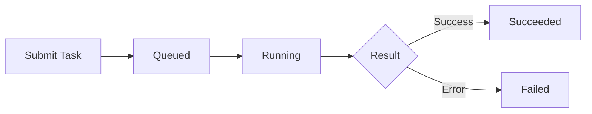

## Task Lifecycle

ACE-Step uses an asynchronous task-based workflow. Each generation request creates a task that moves through several states:



<Steps>
  <Step title="Submit">
    Client calls `POST /release_task` with generation parameters
  </Step>
  <Step title="Queued">
    Task is added to the processing queue and awaits execution
  </Step>
  <Step title="Running">
    Worker picks up the task and begins music generation
  </Step>
  <Step title="Complete">
    Task finishes with status `succeeded` (1) or `failed` (2)
  </Step>
</Steps>

## Task Status Codes

Task status is represented as integer codes:

| Status Code | Name | Description |
| --- | --- | --- |
| `0` | Queued/Running | Task is waiting in queue or currently processing |
| `1` | Succeeded | Generation completed successfully, audio is ready |
| `2` | Failed | Generation failed due to an error |

<CodeGroup>
```python Python
STATUS_QUEUED = 0
STATUS_SUCCEEDED = 1
STATUS_FAILED = 2

def check_status(status_code):
    if status_code == STATUS_QUEUED:
        return "Task is processing..."
    elif status_code == STATUS_SUCCEEDED:
        return "Task completed successfully"
    elif status_code == STATUS_FAILED:
        return "Task failed"
```

```javascript JavaScript
const STATUS_QUEUED = 0;
const STATUS_SUCCEEDED = 1;
const STATUS_FAILED = 2;

function checkStatus(statusCode) {
  if (statusCode === STATUS_QUEUED) {
    return "Task is processing...";
  } else if (statusCode === STATUS_SUCCEEDED) {
    return "Task completed successfully";
  } else if (statusCode === STATUS_FAILED) {
    return "Task failed";
  }
}
```
</CodeGroup>

## Polling for Results

After submitting a task, poll the `/query_result` endpoint to check status and retrieve results.

### Basic Polling Pattern

<CodeGroup>
```python Python
import requests
import time

def wait_for_completion(task_id, max_wait=300, poll_interval=2):
    """Poll task status until completion or timeout."""
    url = "http://localhost:8001/query_result"
    start_time = time.time()
    
    while time.time() - start_time < max_wait:
        response = requests.post(url, json={
            "task_id_list": [task_id]
        })
        
        data = response.json()
        task_data = data["data"][0]
        status = task_data["status"]
        
        if status == 1:  # Succeeded
            return task_data
        elif status == 2:  # Failed
            raise Exception("Task failed")
        
        # Still running, wait before next poll
        time.sleep(poll_interval)
    
    raise TimeoutError(f"Task did not complete within {max_wait}s")
```

```javascript JavaScript
async function waitForCompletion(taskId, maxWait = 300000, pollInterval = 2000) {
  const url = "http://localhost:8001/query_result";
  const startTime = Date.now();
  
  while (Date.now() - startTime < maxWait) {
    const response = await fetch(url, {
      method: "POST",
      headers: { "Content-Type": "application/json" },
      body: JSON.stringify({ task_id_list: [taskId] })
    });
    
    const data = await response.json();
    const taskData = data.data[0];
    const status = taskData.status;
    
    if (status === 1) {  // Succeeded
      return taskData;
    } else if (status === 2) {  // Failed
      throw new Error("Task failed");
    }
    
    // Still running, wait before next poll
    await new Promise(resolve => setTimeout(resolve, pollInterval));
  }
  
  throw new Error(`Task did not complete within ${maxWait}ms`);
}
```

```bash cURL
#!/bin/bash

TASK_ID="$1"
MAX_ATTEMPTS=150  # 5 minutes at 2s intervals

for i in $(seq 1 $MAX_ATTEMPTS); do
  RESPONSE=$(curl -s -X POST http://localhost:8001/query_result \
    -H 'Content-Type: application/json' \
    -d '{"task_id_list": ["'$TASK_ID'"]}' )
  
  STATUS=$(echo $RESPONSE | jq -r '.data[0].status')
  
  if [ "$STATUS" = "1" ]; then
    echo "Task succeeded!"
    echo $RESPONSE | jq '.data[0].result'
    exit 0
  elif [ "$STATUS" = "2" ]; then
    echo "Task failed!"
    exit 1
  fi
  
  echo "Attempt $i: Task still running (status=$STATUS)..."
  sleep 2
done

echo "Timeout: Task did not complete"
exit 1
```
</CodeGroup>

### Adaptive Polling

Use server statistics to calculate intelligent poll intervals:

```python
import requests
import time
import math

def get_estimated_wait_time():
    """Get average job duration from server stats."""
    response = requests.get("http://localhost:8001/v1/stats")
    stats = response.json()["data"]
    return stats["avg_job_seconds"]

def adaptive_poll(task_id):
    """Poll with adaptive intervals based on estimated wait time."""
    avg_duration = get_estimated_wait_time()
    initial_wait = min(avg_duration * 0.8, 5)  # Wait 80% of avg, max 5s
    
    # Initial wait before first poll
    time.sleep(initial_wait)
    
    poll_count = 0
    while True:
        response = requests.post(
            "http://localhost:8001/query_result",
            json={"task_id_list": [task_id]}
        )
        
        task_data = response.json()["data"][0]
        status = task_data["status"]
        
        if status == 1:
            return task_data
        elif status == 2:
            raise Exception("Task failed")
        
        # Exponential backoff: 1s, 2s, 4s, max 10s
        poll_count += 1
        interval = min(2 ** poll_count, 10)
        time.sleep(interval)
```

## Batch Querying

Query multiple tasks simultaneously for efficiency:

```python
import requests

def query_multiple_tasks(task_ids):
    """Query status of multiple tasks in a single request."""
    response = requests.post(
        "http://localhost:8001/query_result",
        json={"task_id_list": task_ids}
    )
    
    results = response.json()["data"]
    
    pending = []
    succeeded = []
    failed = []
    
    for task in results:
        if task["status"] == 0:
            pending.append(task["task_id"])
        elif task["status"] == 1:
            succeeded.append(task)
        elif task["status"] == 2:
            failed.append(task)
    
    return {
        "pending": pending,
        "succeeded": succeeded,
        "failed": failed
    }
```

## Queue Position Tracking

The `/release_task` response includes queue position:

```json
{
  "data": {
    "task_id": "550e8400-e29b-41d4-a716-446655440000",
    "status": "queued",
    "queue_position": 3  // 2 tasks ahead of this one
  }
}
```

Use this to estimate wait time:

```python
import requests

def estimate_wait_time(queue_position):
    """Estimate wait time based on queue position and avg job time."""
    stats_response = requests.get("http://localhost:8001/v1/stats")
    stats = stats_response.json()["data"]
    
    avg_job_seconds = stats["avg_job_seconds"]
    estimated_seconds = queue_position * avg_job_seconds
    
    return {
        "seconds": estimated_seconds,
        "minutes": estimated_seconds / 60,
        "human": f"{int(estimated_seconds // 60)}m {int(estimated_seconds % 60)}s"
    }

# Example usage
task_response = requests.post(
    "http://localhost:8001/release_task",
    json={"prompt": "epic orchestral music"}
)

task_data = task_response.json()["data"]
queue_position = task_data["queue_position"]

wait_estimate = estimate_wait_time(queue_position)
print(f"Estimated wait: {wait_estimate['human']}")
```

## Error Handling

### Task Submission Errors

<Tabs>
  <Tab title="Queue Full (429)">
    Server queue is at capacity. Implement retry with backoff:
    
    ```python
    import time
    from requests.exceptions import HTTPError
    
    def submit_with_retry(params, max_retries=5):
        for attempt in range(max_retries):
            try:
                response = requests.post(
                    "http://localhost:8001/release_task",
                    json=params
                )
                response.raise_for_status()
                return response.json()
            except HTTPError as e:
                if e.response.status_code == 429:
                    if attempt < max_retries - 1:
                        wait = 2 ** attempt  # Exponential backoff
                        print(f"Queue full, retrying in {wait}s...")
                        time.sleep(wait)
                        continue
                raise
    ```
  </Tab>
  
  <Tab title="Invalid Parameters (400)">
    Request validation failed. Check error message:
    
    ```python
    try:
        response = requests.post(
            "http://localhost:8001/release_task",
            json={"bpm": 999}  # Invalid BPM
        )
        response.raise_for_status()
    except HTTPError as e:
        if e.response.status_code == 400:
            error = e.response.json()
            print(f"Invalid request: {error['detail']}")
    ```
  </Tab>
  
  <Tab title="Authentication (401)">
    Missing or invalid API key:
    
    ```python
    headers = {
        "Authorization": "Bearer your-api-key",
        "Content-Type": "application/json"
    }
    
    try:
        response = requests.post(
            "http://localhost:8001/release_task",
            headers=headers,
            json={"prompt": "test"}
        )
        response.raise_for_status()
    except HTTPError as e:
        if e.response.status_code == 401:
            print("Authentication failed - check API key")
    ```
  </Tab>
</Tabs>

### Task Execution Errors

When a task fails (status=2), parse the result for error details:

```python
import json

def handle_task_result(task_data):
    status = task_data["status"]
    
    if status == 1:  # Success
        result = json.loads(task_data["result"])
        return result[0]["file"]  # Audio URL
    
    elif status == 2:  # Failed
        # Parse result for error message
        try:
            result = json.loads(task_data["result"])
            error_msg = result[0].get("error", "Unknown error")
        except:
            error_msg = "Task failed without error details"
        
        raise Exception(f"Generation failed: {error_msg}")
    
    else:  # Still running
        return None
```

## Timeout Handling

Tasks have a server-side timeout (default: 3600 seconds). Implement client-side timeouts:

```python
import requests
import time

class TaskTimeout(Exception):
    pass

def wait_for_task(task_id, timeout=600):
    """Wait for task with client-side timeout."""
    start = time.time()
    
    while True:
        elapsed = time.time() - start
        
        if elapsed > timeout:
            raise TaskTimeout(
                f"Task {task_id} did not complete within {timeout}s"
            )
        
        response = requests.post(
            "http://localhost:8001/query_result",
            json={"task_id_list": [task_id]}
        )
        
        task = response.json()["data"][0]
        
        if task["status"] == 1:
            return task
        elif task["status"] == 2:
            raise Exception("Task failed")
        
        # Poll more frequently as we approach timeout
        remaining = timeout - elapsed
        interval = min(remaining / 10, 5)
        time.sleep(max(interval, 1))
```

## Complete Example

End-to-end example with robust error handling:

```python
import requests
import time
import json
from typing import Dict, Any

class ACEStepClient:
    def __init__(self, base_url="http://localhost:8001", api_key=None):
        self.base_url = base_url
        self.headers = {"Content-Type": "application/json"}
        if api_key:
            self.headers["Authorization"] = f"Bearer {api_key}"
    
    def create_task(self, **params) -> str:
        """Submit generation task and return task ID."""
        response = requests.post(
            f"{self.base_url}/release_task",
            headers=self.headers,
            json=params
        )
        response.raise_for_status()
        return response.json()["data"]["task_id"]
    
    def query_task(self, task_id: str) -> Dict[str, Any]:
        """Query single task status."""
        response = requests.post(
            f"{self.base_url}/query_result",
            headers=self.headers,
            json={"task_id_list": [task_id]}
        )
        response.raise_for_status()
        return response.json()["data"][0]
    
    def wait_for_completion(self, task_id: str, timeout=600, poll_interval=2):
        """Wait for task to complete with timeout."""
        start = time.time()
        
        while time.time() - start < timeout:
            task = self.query_task(task_id)
            status = task["status"]
            
            if status == 1:  # Success
                result = json.loads(task["result"])
                return result
            elif status == 2:  # Failed
                try:
                    result = json.loads(task["result"])
                    error = result[0].get("error", "Unknown error")
                except:
                    error = "Task failed"
                raise Exception(f"Task failed: {error}")
            
            time.sleep(poll_interval)
        
        raise TimeoutError(f"Task {task_id} timed out after {timeout}s")
    
    def generate_music(self, **params) -> list:
        """High-level method: submit task and wait for results."""
        task_id = self.create_task(**params)
        print(f"Task created: {task_id}")
        
        results = self.wait_for_completion(task_id)
        print(f"Task completed: {len(results)} outputs")
        
        return results

# Usage
client = ACEStepClient(api_key="your-api-key")

try:
    results = client.generate_music(
        prompt="epic orchestral music",
        lyrics="Rise above the clouds",
        thinking=True,
        batch_size=2
    )
    
    for i, result in enumerate(results):
        audio_url = result["file"]
        print(f"Result {i+1}: {audio_url}")
        
except Exception as e:
    print(f"Error: {e}")
```

## Best Practices

<AccordionGroup>
  <Accordion title="Use Adaptive Polling">
    - Query `/v1/stats` to get average job duration
    - Start with longer intervals, increase frequency near expected completion
    - Implement exponential backoff to reduce server load
  </Accordion>
  
  <Accordion title="Handle Rate Limits">
    - Monitor queue size via `/v1/stats`
    - Implement retry logic for 429 responses
    - Spread task submissions over time when bulk processing
  </Accordion>
  
  <Accordion title="Batch Queries">
    - Query multiple tasks in a single request
    - Reduces network overhead and server load
    - Maximum efficiency for bulk generation workflows
  </Accordion>
  
  <Accordion title="Set Appropriate Timeouts">
    - Default server timeout: 3600 seconds (1 hour)
    - Set client timeout based on generation parameters
    - Longer audio (>5 minutes) may take 30-60 seconds
  </Accordion>
  
  <Accordion title="Graceful Error Recovery">
    - Parse error messages from failed tasks
    - Implement exponential backoff for retries
    - Log task IDs for debugging and audit trails
  </Accordion>
</AccordionGroup>
