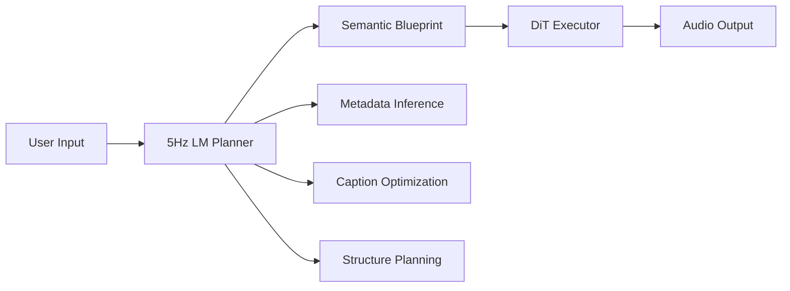

# ACE-Step 1.5 Architecture

ACE-Step 1.5 employs a novel **hybrid architecture** where a Language Model (LM) and Diffusion Transformer (DiT) work in tandem to generate high-quality music efficiently.

For a visual representation of the architecture, see the [ACE-Step Framework diagram](https://github.com/ace-step/ACE-Step-1.5/blob/main/assets/ACE-Step_framework.png) in the source repository.

## Two-Brain System

The architecture consists of two core components that collaborate to transform user intent into audio:



### 5Hz LM: The Omni-Capable Planner

The Language Model functions as an intelligent planner responsible for:

<CardGroup cols={2}>
  <Card title="Chain-of-Thought Reasoning" icon="brain">
    Infers music metadata (BPM, key, duration) through structured reasoning
  </Card>
  <Card title="Caption Enhancement" icon="pencil">
    Optimizes and expands user descriptions to capture full intent
  </Card>
  <Card title="Semantic Encoding" icon="code">
    Generates semantic codes containing composition, melody, and orchestration
  </Card>
  <Card title="Audio Understanding" icon="waveform">
    Extracts metadata and captions from existing audio
  </Card>
</CardGroup>

**Key Characteristics:**
- Pre-trained on Qwen3 (0.6B, 1.7B, 4B variants)
- Learns world knowledge about music styles, instruments, and production
- **Optional component** — can be bypassed when using audio references directly

<Note>
  The LM is not required for generation. In Cover mode, you can use reference audio to control structure, essentially replacing the LM's planning role with your own creative direction.
</Note>

### DiT: The Audio Craftsman

The Diffusion Transformer executes the plan by:

<CardGroup cols={2}>
  <Card title="Diffusion Process" icon="arrows-rotate">
    Gradually carves audio from noise through iterative denoising
  </Card>
  <Card title="Condition Following" icon="bullseye">
    Receives semantic codes and text conditions from LM
  </Card>
  <Card title="Timbre Control" icon="sliders">
    Determines final timbre, mixing, and production details
  </Card>
  <Card title="Multi-Task Capable" icon="layer-group">
    Handles text2music, cover, repaint, extraction, and layering
  </Card>
</CardGroup>

**Technical Details:**
- Based on Diffusion Transformer architecture
- Operates on 5Hz latent space (48kHz audio → 5Hz semantic codes)
- Supports both ODE (deterministic) and SDE (stochastic) sampling

## Why This Design?

Traditional text-to-audio diffusion models face a fundamental challenge: **text-to-audio mapping is too vague**. ACE-Step solves this by introducing the LM as an intermediate layer:

<Tabs>
  <Tab title="Traditional Approach">
    ```
    Text Prompt → DiT → Audio
    ```
    
    **Problems:**
    - Vague semantic understanding
    - Limited compositional control
    - Difficulty with complex structures
  </Tab>
  <Tab title="ACE-Step Approach">
    ```
    Text → LM (semantic reasoning) → Semantic Codes → DiT → Audio
    ```
    
    **Advantages:**
    - LM excels at semantic understanding and planning
    - DiT excels at high-fidelity audio generation
    - Clear separation of concerns
    - Each component does what it does best
  </Tab>
</Tabs>

## Workflow Examples

### Text-to-Music Generation

```python
from acestep.handler import AceStepHandler
from acestep.llm_inference import LLMHandler
from acestep.inference import GenerationParams, GenerationConfig, generate_music

# Initialize both handlers
dit_handler = AceStepHandler()
llm_handler = LLMHandler()

# LM plans the composition
params = GenerationParams(
    caption="upbeat electronic dance music with heavy bass",
    lyrics="[Instrumental]",
    thinking=True,  # Enable LM Chain-of-Thought
    use_cot_metas=True  # LM infers BPM, key, etc.
)

# DiT executes the plan
result = generate_music(dit_handler, llm_handler, params, config)
```

### Cover Mode (LM-Free)

```python
# Use reference audio to control structure
# LM is bypassed — you provide the "plan" via audio
params = GenerationParams(
    task_type="cover",
    src_audio="reference_song.mp3",
    caption="rock style with electric guitar",
    thinking=False  # LM not needed
)

result = generate_music(dit_handler, None, params, config)
```

## Reinforcement Learning Alignment

<Note>
  ACE-Step 1.5 achieves alignment through **intrinsic reinforcement learning** relying solely on the model's internal mechanisms, eliminating biases from external reward models or human preferences.
</Note>

The RL-enhanced model (`turbo-rl`) optimizes for:
- Improved prompt adherence
- Better musical coherence
- Enhanced audio quality
- Stronger lyric-audio alignment

This approach ensures the model learns from its own internal consistency rather than external biases.

## Architecture Benefits

<CardGroup cols={3}>
  <Card title="Flexibility" icon="arrows-split-up-and-left">
    LM can be enabled or disabled based on use case
  </Card>
  <Card title="Efficiency" icon="bolt">
    Semantic compression enables fast generation
  </Card>
  <Card title="Scalability" icon="up-right-and-down-left-from-center">
    Generate 10s to 10 minutes with same architecture
  </Card>
  <Card title="Controllability" icon="hand">
    Multiple control methods: text, audio, metadata
  </Card>
  <Card title="Modularity" icon="cubes">
    Components can be fine-tuned independently
  </Card>
  <Card title="Extensibility" icon="puzzle-piece">
    Easy to add new capabilities via LoRA
  </Card>
</CardGroup>

## Technical Specifications

### Latent Space

- **Audio Input:** 48kHz stereo
- **Semantic Frequency:** 5Hz (9.6x compression in time dimension)
- **VAE Architecture:** Variational Autoencoder with tiled encoding/decoding
- **Latent Representation:** Continuous semantic codes

### Diffusion Process

- **Method:** Flow-based diffusion with ODE/SDE sampling
- **Steps:** 8 (turbo), 50 (SFT/Base)
- **Shift Parameter:** Controls timestep allocation (1.0-3.0)
- **CFG Support:** Classifier-Free Guidance for SFT/Base models

### Language Model

- **Base Models:** Qwen3-0.6B/1.7B/4B
- **Training:** Pre-training + SFT + RL
- **Capabilities:** CoT reasoning, query rewriting, audio understanding
- **Output Format:** Structured semantic codes + metadata

## Next Steps

<CardGroup cols={2}>
  <Card title="Model Zoo" icon="building-columns" href="/model/model-zoo">
    Explore available model variants and their capabilities
  </Card>
  <Card title="Performance" icon="gauge-high" href="/model/performance">
    See benchmark results across different hardware
  </Card>
  <Card title="Tutorial" icon="graduation-cap" href="/model/tutorial">
    Learn how to choose and use different models
  </Card>
  <Card title="API Reference" icon="code" href="/api-reference/inference/overview">
    Detailed API documentation for generation
  </Card>
</CardGroup>
