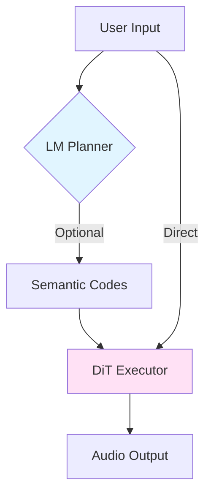
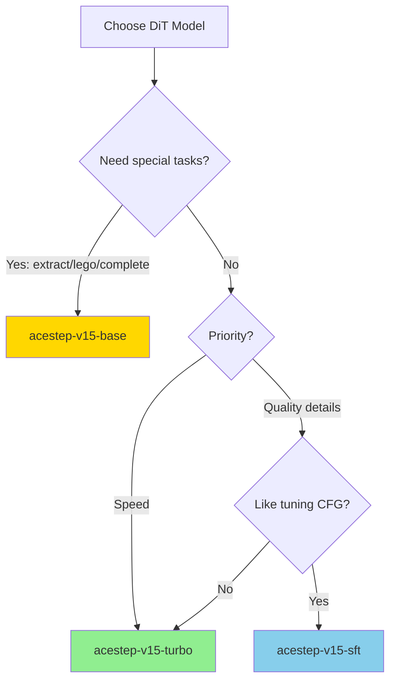
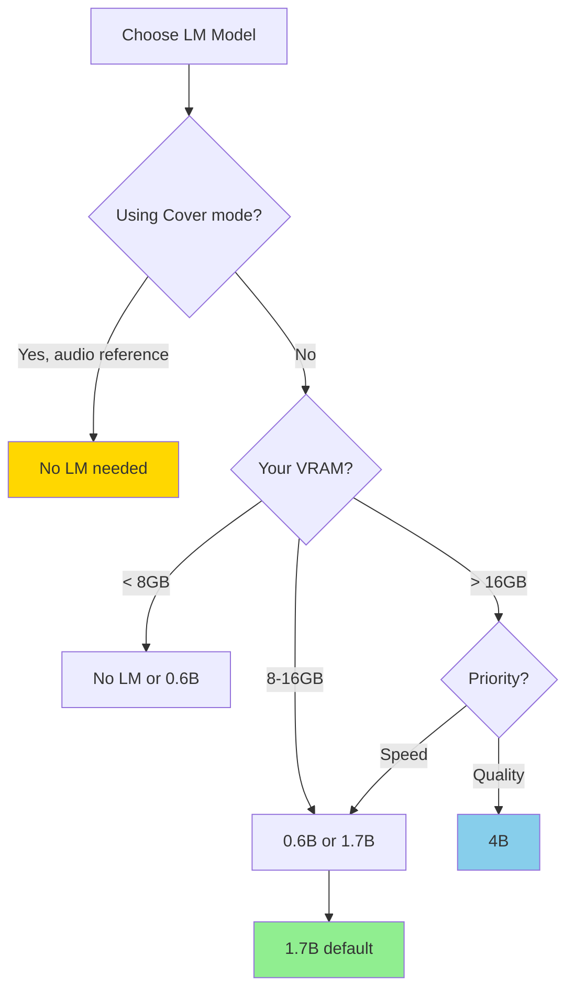

# Model Selection Tutorial

This guide helps you understand ACE-Step 1.5's model architecture and choose the right models for your needs.

## Understanding the Elephant Herd

<Note>
  ACE-Step isn't one model — it's a **family of models** working together like an elephant herd, each with different strengths and characteristics.
</Note>

### The Two-Brain System

ACE-Step uses a hybrid architecture with two components:



<Tabs>
  <Tab title="5Hz LM (Planner)">
    **The Intelligent Planner**
    
    **Role:**
    - Understands your intent through Chain-of-Thought reasoning
    - Infers metadata (BPM, key, duration)
    - Optimizes and expands your descriptions
    - Generates semantic codes (melody, orchestration, structure)
    
    **Key Point:**  
    The LM is **optional**. You can skip it and provide structure via audio references directly.
    
    **Models:**
    - `acestep-5Hz-lm-0.6B` — Lightweight, basic knowledge
    - `acestep-5Hz-lm-1.7B` — Balanced, recommended default
    - `acestep-5Hz-lm-4B` — Best quality, richest knowledge
  </Tab>
  <Tab title="DiT (Executor)">
    **The Audio Craftsman**
    
    **Role:**
    - Executes the plan (from LM or audio reference)
    - Diffusion process: gradually carves audio from noise
    - Controls final timbre, mixing, and production details
    
    **Key Point:**  
    DiT is **always required** — it's the core audio generator.
    
    **Models:**
    - `acestep-v15-turbo` — 8 steps, ultra-fast, recommended
    - `acestep-v15-sft` — 50 steps, CFG support, detailed
    - `acestep-v15-base` — 50 steps, multi-task master
  </Tab>
</Tabs>

## Step 1: Choose Your DiT Model

### Decision Tree



### Quick Comparison

<CardGroup cols={3}>
  <Card title="Turbo" icon="rocket">
    **Best for most users**
    
    ✅ 8 steps (6x faster)  
    ✅ Excellent quality  
    ✅ No CFG needed  
    ✅ Daily use
    
    ❌ No extract/lego/complete
  </Card>
  <Card title="SFT" icon="sliders">
    **For detail enthusiasts**
    
    ✅ 50 steps (more refinement)  
    ✅ CFG tuning (1.0-15.0)  
    ✅ Better semantic parsing  
    
    ❌ 6x slower  
    ❌ No extract/lego/complete
  </Card>
  <Card title="Base" icon="crown">
    **For advanced tasks**
    
    ✅ Extract stems  
    ✅ Layer tracks (lego)  
    ✅ Generate accompaniment  
    ✅ Fine-tuning foundation  
    
    ❌ 6x slower
  </Card>
</CardGroup>

### Turbo Variants

The `turbo` model has specialized variants distilled with different shift parameters:

<Tabs>
  <Tab title="turbo (default)">
    **Recommended starting point**
    
    - Joint distillation on shift 1, 2, 3
    - Best balance of creativity and semantics
    - Most thoroughly tested
    - Works well for all styles
    
    ```bash
    uv run acestep-download --model acestep-v15-turbo
    ```
  </Tab>
  <Tab title="turbo-shift1">
    **For rich, detailed production**
    
    - More texture and details
    - Richer orchestration
    - Weaker semantic adherence
    - Can be more "messy" or creative
    
    Best for: Complex arrangements, textured sounds
  </Tab>
  <Tab title="turbo-shift3">
    **For clean, simple production**
    
    - Clearer overall structure
    - Stronger prompt following
    - Richer timbre but may sound "dry"
    - Minimal orchestration complexity
    
    Best for: Simple, clean tracks; strong semantic control
  </Tab>
  <Tab title="turbo-continuous">
    **Experimental: For advanced users**
    
    - Supports continuous shift 1-5 at inference
    - Most flexible tuning options
    - Less thoroughly tested
    - Requires understanding of shift parameter
    
    Best for: Advanced users experimenting with shift
  </Tab>
</Tabs>

<Note>
  **What is shift?** Shift controls how diffusion timesteps are allocated. Higher shift = more focus on building structure early (clear framework). Lower shift = more even distribution (richer details).
</Note>

## Step 2: Choose Your LM Model

### Decision Tree



### VRAM-Based Recommendations

| Your GPU VRAM | Recommended LM | Backend | Notes |
|---------------|---------------|---------|-------|
| **≤6GB** | None (DiT only) | — | LM disabled; use manual metadata or Cover mode |
| **6-8GB** | `0.6B` | PyTorch | Lightweight LM, basic planning |
| **8-16GB** | `1.7B` | vLLM | **Default recommendation** — best balance |
| **16-24GB** | `1.7B` or `4B` | vLLM | 4B available on 20GB+, no offload needed |
| **≥24GB** | `4B` | vLLM | Best quality, strongest composition ability |

### Feature Comparison

<Tabs>
  <Tab title="No LM">
    **Maximum speed, manual control**
    
    **When to use:**
    - Cover mode (audio reference provides structure)
    - You provide all metadata manually
    - Absolute fastest generation
    - VRAM < 6GB
    
    **Example:**
    ```python
    params = GenerationParams(
        thinking=False,  # Disable LM
        caption="rock guitar with drums",
        bpm=120,  # Manual metadata
        keyscale="E Minor",
        duration=60
    )
    ```
  </Tab>
  <Tab title="0.6B">
    **Basic planning, low VRAM**
    
    **Capabilities:**
    - Basic world knowledge
    - Simple prompt understanding
    - Weak melody copying
    - CoT metadata inference
    
    **Best for:**
    - 6-8GB VRAM
    - Simple, straightforward prompts
    - Rapid prototyping
    - When speed matters more than sophistication
    
    ```bash
    uv run acestep-download --model acestep-5Hz-lm-0.6B
    ```
  </Tab>
  <Tab title="1.7B (Default)">
    **Balanced quality and speed**
    
    **Capabilities:**
    - Medium world knowledge
    - Good prompt understanding
    - Medium melody copying
    - Reliable CoT reasoning
    
    **Best for:**
    - 8-16GB VRAM
    - General-purpose generation
    - Most users
    - Daily music creation
    
    ```bash
    uv run acestep-download --model acestep-5Hz-lm-1.7B
    ```
    
    <Note>
      This is the **recommended default** for most users.
    </Note>
  </Tab>
  <Tab title="4B">
    **Best quality, richest knowledge**
    
    **Capabilities:**
    - Rich world knowledge
    - Strong prompt understanding
    - Strong melody copying from reference
    - Best audio understanding
    - Best composition capability
    
    **Best for:**
    - 16GB+ VRAM
    - Complex compositions
    - Long-tail styles/instruments
    - Copying melodies from reference audio
    - Maximum quality generation
    
    ```bash
    uv run acestep-download --model acestep-5Hz-lm-4B
    ```
  </Tab>
</Tabs>

## Step 3: Configure for Your Hardware

ACE-Step automatically optimizes for your GPU, but understanding the tiers helps you make informed choices.

### GPU Tier System

<Tabs>
  <Tab title="4GB (Tier 1)">
    **Budget GPU: GTX 1650, GTX 1660**
    
    **Auto Configuration:**
    - DiT: `turbo` + INT8 quantization
    - LM: None (disabled)
    - CPU offload: Full (all models)
    - VAE: Decodes on CPU
    - Tiled VAE: chunk=256
    
    **Limitations:**
    - No LM features
    - Single batch only
    - Max duration: 120s
    - Slower generation
    
    **Best Practice:**
    Use Cover mode with audio references to bypass LM requirement.
  </Tab>
  <Tab title="6-8GB (Tier 2-4)">
    **Mid-range GPU: GTX 1660 Ti, RTX 3060**
    
    **Auto Configuration:**
    - DiT: `turbo` + optional INT8
    - LM: `0.6B` (PyTorch backend)
    - CPU offload: When needed
    - VAE: Tiled decoding
    
    **Capabilities:**
    - Basic LM features
    - Batch size: 1-2
    - Max duration: 240s
    
    **Best Practice:**
    Use `0.6B` LM for simple prompts, disable for Cover mode.
  </Tab>
  <Tab title="12-16GB (Tier 5-6)">
    **High-end Consumer: RTX 3090, RTX 4070 Ti**
    
    **Auto Configuration:**
    - DiT: `turbo` (no quantization)
    - LM: `1.7B` (vLLM backend)
    - CPU offload: Minimal
    - VAE: GPU decoding
    
    **Capabilities:**
    - Full LM features
    - Batch size: 2-4
    - Max duration: 600s (10 min)
    
    **Best Practice:**
    Default configuration is optimal. Consider `4B` LM on 16GB.
  </Tab>
  <Tab title="24GB+ (Unlimited)">
    **Enthusiast/Pro: RTX 3090, RTX 4090, A100**
    
    **Auto Configuration:**
    - DiT: `turbo` or `sft`/`base` (your choice)
    - LM: `4B` (vLLM backend)
    - CPU offload: None
    - VAE: GPU decoding
    
    **Capabilities:**
    - All features unlocked
    - Batch size: 4-8
    - Max duration: 600s (10 min)
    - Best quality
    
    **Best Practice:**
    Use `4B` LM for complex prompts, `1.7B` for speed.
  </Tab>
</Tabs>

## Common Combinations

### By Use Case

<CardGroup cols={2}>
  <Card title="Daily Music Creation" icon="music">
    **DiT:** `turbo`  
    **LM:** `1.7B`
    
    - Best balance of quality and speed
    - 3-10s per song (depending on hardware)
    - Suitable for most styles
  </Card>
  <Card title="Production Quality" icon="star">
    **DiT:** `sft`  
    **LM:** `4B`
    
    - Maximum quality and detail
    - Fine-tune with CFG
    - 15-40s per song
  </Card>
  <Card title="Rapid Prototyping" icon="forward-fast">
    **DiT:** `turbo`  
    **LM:** `0.6B` or None
    
    - Fastest generation
    - 2-7s per song
    - Great for iteration
  </Card>
  <Card title="Cover/Remix" icon="clone">
    **DiT:** `turbo`  
    **LM:** None
    
    - Audio reference controls structure
    - No LM overhead
    - Fast style transfer
  </Card>
  <Card title="Stem Separation" icon="layer-group">
    **DiT:** `base`  
    **LM:** `1.7B`
    
    - Extract, lego, complete tasks
    - Professional workflow
    - Multi-track composition
  </Card>
  <Card title="Low VRAM (< 8GB)" icon="microchip">
    **DiT:** `turbo` + INT8  
    **LM:** None or `0.6B`
    
    - Optimized for budget GPUs
    - Automatic CPU offload
    - Still usable performance
  </Card>
</CardGroup>

### By Music Style

| Style | DiT Model | LM Model | Notes |
|-------|-----------|----------|-------|
| **Electronic/EDM** | `turbo` or `turbo-shift1` | `1.7B` | Rich details work well for electronic |
| **Rock/Metal** | `turbo` or `sft` | `1.7B` or `4B` | More steps help with complex guitar tones |
| **Classical** | `sft` or `base` | `4B` | Best for orchestral complexity |
| **Pop** | `turbo` (default) | `1.7B` | Default configuration is ideal |
| **Lo-Fi/Ambient** | `turbo-shift1` | `0.6B` or `1.7B` | Texture-rich shift1 variant |
| **Hip-Hop/Rap** | `turbo` | `1.7B` or `4B` | Good vocal control with larger LM |

## Download and Install

### Download Specific Models

```bash
# Download default recommended combination
uv run acestep-download
# Downloads: turbo + 1.7B LM

# Download all models
uv run acestep-download --all

# Download specific DiT model
uv run acestep-download --model acestep-v15-turbo
uv run acestep-download --model acestep-v15-sft
uv run acestep-download --model acestep-v15-base

# Download specific LM model
uv run acestep-download --model acestep-5Hz-lm-0.6B
uv run acestep-download --model acestep-5Hz-lm-1.7B
uv run acestep-download --model acestep-5Hz-lm-4B

# List available models
uv run acestep-download --list
```

### Configure in Code

```python
from acestep.handler import AceStepHandler
from acestep.llm_inference import LLMHandler

# Initialize DiT handler
dit_handler = AceStepHandler()
dit_handler.initialize_service(
    project_root="/path/to/project",
    config_path="acestep-v15-turbo",  # or sft, base
    device="cuda"
)

# Initialize LM handler (optional)
llm_handler = LLMHandler()
llm_handler.initialize(
    checkpoint_dir="/path/to/checkpoints",
    lm_model_path="acestep-5Hz-lm-1.7B",  # or 0.6B, 4B
    backend="vllm",  # or pt, mlx
    device="cuda"
)
```

### Configure via Environment

```bash
# Create .env file
cat > .env << EOF
ACESTEP_CONFIG_PATH=acestep-v15-turbo
ACESTEP_LM_MODEL_PATH=acestep-5Hz-lm-1.7B
DEVICE=cuda
LM_BACKEND=vllm
EOF

# Launch with configuration
uv run acestep
```

## Advanced: LoRA Fine-Tuning

<Card title="Create Your Own Custom Model" icon="wand-magic-sparkles">
  Train LoRA adapters to customize DiT for your unique aesthetic.
</Card>

**What You Can Customize:**
- Timbre preferences (warm, bright, vintage, modern)
- Genre specialization (metal, jazz, lo-fi, classical)
- Production style (polished, raw, bedroom pop)
- Your personal taste and aesthetic

**Training Requirements:**
- **Data:** 8-20+ songs in your target style
- **Hardware:** RTX 3090 (12GB) or better
- **Time:** ~1 hour for 20 songs on RTX 3090
- **Base Model:** Use `acestep-v15-base` for best fine-tuning results

**Resources:**
- [LoRA Training Tutorial](/training/lora-training)
- Gradio UI "LoRA Training" tab for one-click training
- Example LoRA: "Happy New Year" themed (festive atmosphere)

```bash
# Launch Gradio UI
uv run acestep
# Navigate to "LoRA Training" tab
```

## Troubleshooting

### Out of Memory (OOM)

<Tabs>
  <Tab title="Symptoms">
    ```
    CUDA out of memory. Tried to allocate X.XX GiB
    ```
  </Tab>
  <Tab title="Solutions">
    1. **Use smaller LM model**
       ```bash
       --lm-model acestep-5Hz-lm-0.6B
       ```
    
    2. **Disable LM**
       ```python
       params = GenerationParams(thinking=False)
       ```
    
    3. **Enable INT8 quantization**
       ```bash
       --quantization int8_weight_only
       ```
    
    4. **Enable CPU offload**
       ```bash
       --offload-to-cpu
       ```
    
    5. **Reduce batch size**
       ```python
       config = GenerationConfig(batch_size=1)
       ```
    
    6. **Reduce duration**
       ```python
       params = GenerationParams(duration=30)  # instead of 60+
       ```
  </Tab>
</Tabs>

### Poor Quality Results

<Tabs>
  <Tab title="Try This">
    1. **Use larger LM model**
       - `0.6B` → `1.7B` or `4B`
       - Better prompt understanding
    
    2. **Enable thinking mode**
       ```python
       params = GenerationParams(
           thinking=True,
           use_cot_metas=True,
           use_cot_caption=True
       )
       ```
    
    3. **Try SFT model with CFG**
       ```python
       params = GenerationParams(
           inference_steps=50,
           guidance_scale=7.0  # tune 1.0-15.0
       )
       ```
    
    4. **Use different turbo variant**
       - Default → `turbo-shift3` for cleaner sound
       - Default → `turbo-shift1` for richer details
    
    5. **Improve your prompts**
       - Be more specific
       - Add more dimensions (style + instruments + emotion + timbre)
       - Check Tutorial for prompting tips
  </Tab>
</Tabs>

### Slow Generation

<Tabs>
  <Tab title="Check This">
    1. **Use turbo model (not SFT/Base)**
       - 8 steps vs 50 steps = 6x speedup
    
    2. **Use smaller/no LM**
       - `4B` → `1.7B` → `0.6B` → None
    
    3. **Disable thinking mode**
       ```python
       params = GenerationParams(thinking=False)
       ```
    
    4. **Reduce batch size**
       - Larger batches are faster per-song but use more VRAM
    
    5. **Check GPU utilization**
       ```bash
       nvidia-smi -l 1
       ```
       - Should see high GPU usage during generation
    
    6. **Ensure CUDA is being used**
       ```bash
       python -c "import torch; print(torch.cuda.is_available())"
       ```
       - Should print `True`
  </Tab>
</Tabs>

## Next Steps

<CardGroup cols={2}>
  <Card title="Architecture Deep Dive" icon="diagram-project" href="/model/architecture">
    Understand the hybrid LM-DiT architecture in detail
  </Card>
  <Card title="Model Zoo" icon="building-columns" href="/model/model-zoo">
    Explore all available model variants
  </Card>
  <Card title="Performance Benchmarks" icon="gauge-high" href="/model/performance">
    See real-world performance across hardware
  </Card>
  <Card title="Getting Started" icon="rocket" href="/quickstart">
    Install and run your first generation
  </Card>
</CardGroup>
